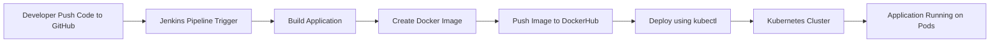
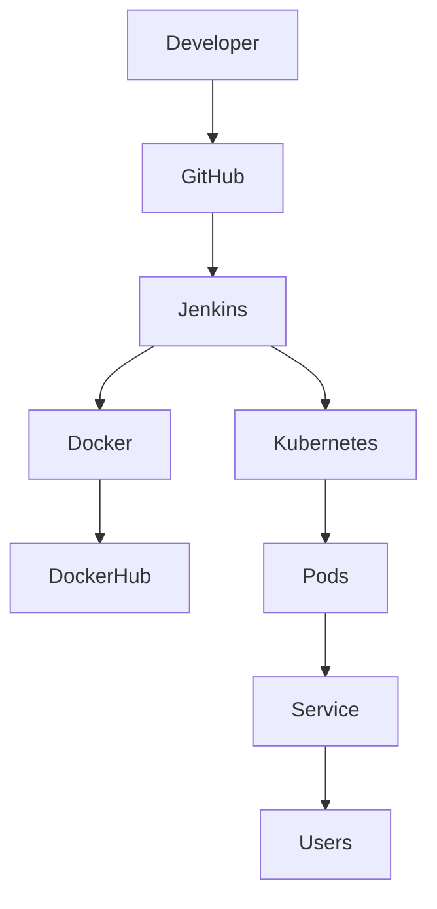

# DevOps CI/CD Pipeline using Jenkins, Docker and Kubernetes

## 📌 Project Overview

This project demonstrates a complete **DevOps CI/CD pipeline** that automatically builds, tests, containerizes, and deploys an application using **Jenkins, Docker, and Kubernetes** on AWS EC2 instances.

The goal of this project is to simulate a **real-world DevOps workflow** where code changes pushed to GitHub trigger automated pipelines that deploy the application to a Kubernetes cluster.

---

## 🛠 Tech Stack

* AWS EC2
* Linux (Amazon Linux / RHEL)
* Jenkins
* Docker
* Kubernetes
* Git & GitHub
* kubectl
* DockerHub

---

## 🏗 Infrastructure Architecture



---

## ⚙️ Project Architecture



---

# 🚀 Step-by-Step Implementation

## 1️⃣ Launch AWS EC2 Instance

Create an EC2 instance and install required tools.

Update system

```
sudo dnf update -y
```

---

## 2️⃣ Install Jenkins

```
sudo dnf install java-17-amazon-corretto -y
sudo wget -O /etc/yum.repos.d/jenkins.repo https://pkg.jenkins.io/redhat-stable/jenkins.repo
sudo rpm --import https://pkg.jenkins.io/redhat-stable/jenkins.io.key
sudo dnf install jenkins -y
```

Start Jenkins

```
sudo systemctl enable jenkins
sudo systemctl start jenkins
```

Access Jenkins

```
http://EC2-IP:8080
```

---

## 3️⃣ Install Docker

```
sudo dnf install docker -y
sudo systemctl start docker
sudo systemctl enable docker
sudo usermod -aG docker jenkins
```

Restart Jenkins

```
sudo systemctl restart jenkins
```

---

## 4️⃣ Install kubectl

```
curl -LO "https://dl.k8s.io/release/$(curl -L -s https://dl.k8s.io/release/stable.txt)/bin/linux/amd64/kubectl"

chmod +x kubectl
sudo mv kubectl /usr/local/bin/
```

Verify

```
kubectl version --client
```

---

## 5️⃣ Configure Kubernetes Cluster

Initialize cluster

```
sudo kubeadm init
```

Configure kubeconfig

```
mkdir -p $HOME/.kube
sudo cp -i /etc/kubernetes/admin.conf $HOME/.kube/config
sudo chown $(id -u):$(id -g) $HOME/.kube/config
```

---

## 6️⃣ Jenkins Pipeline

Create a **Jenkins Pipeline Job** connected to GitHub repository.

Pipeline stages:

1. Pull Code from GitHub
2. Build Application
3. Build Docker Image
4. Push Image to DockerHub
5. Deploy to Kubernetes

Example Jenkinsfile

```
pipeline {
    agent any

    stages {

        stage('Clone Repository') {
            steps {
                git 'https://github.com/yourusername/devops-cicd-jenkins-docker-kubernetes.git'
            }
        }

        stage('Build Docker Image') {
            steps {
                sh 'docker build -t yourdockerhub/app:v1 .'
            }
        }

        stage('Push Docker Image') {
            steps {
                sh 'docker push yourdockerhub/app:v1'
            }
        }

        stage('Deploy to Kubernetes') {
            steps {
                sh 'kubectl apply -f deployment.yaml'
            }
        }
    }
}
```

---

## 📦 Kubernetes Deployment

Deployment file example

```
apiVersion: apps/v1
kind: Deployment
metadata:
  name: devops-app
spec:
  replicas: 2
  selector:
    matchLabels:
      app: devops-app
  template:
    metadata:
      labels:
        app: devops-app
    spec:
      containers:
      - name: devops-container
        image: yourdockerhub/app:v1
        ports:
        - containerPort: 80
```

---

## 🔎 Verification

Check pods

```
kubectl get pods
```

Check services

```
kubectl get svc
```

---

## 📊 Key Features

✔ End-to-End CI/CD Pipeline
✔ Automated Docker Image Build
✔ Automated Kubernetes Deployment
✔ Infrastructure on AWS
✔ Production-like DevOps Workflow

---

## 📸 Screenshots to Add

You can add screenshots for:

* Jenkins Dashboard
* Jenkins Pipeline Build
* Docker Image Build
* Kubernetes Pods Running
* Application Running in Browser

---

## 📚 Learning Outcomes

* Jenkins CI/CD Pipeline
* Containerization using Docker
* Kubernetes Deployment
* DevOps automation workflow
* GitHub integration with Jenkins
